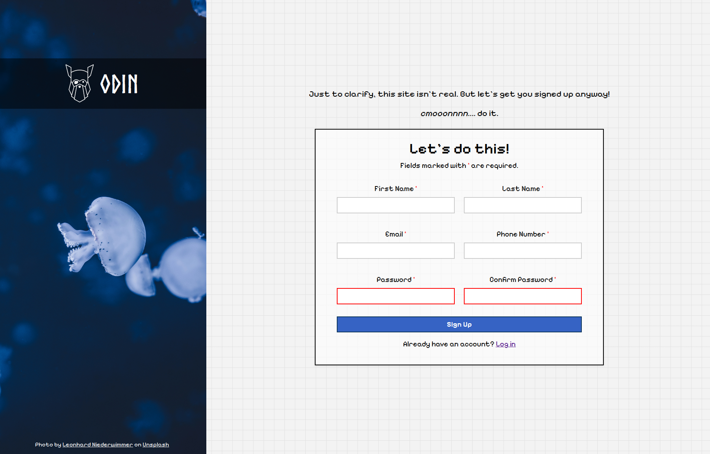
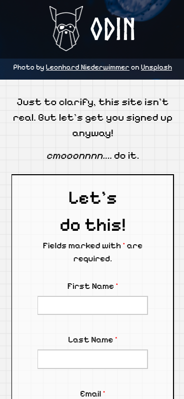

# sign-up-form

## Description

* A responsive sign-up form built as part of a front-end project.
* Demonstrates semantic HTML5 structure, CSS Flexbox/Grid for layouts, responsive design with media queries, and form validation styling.
* Includes a split layout: splash panel (with background image and logo) + sign-up form.

## Features

* 📱 **Responsive Layout**: Adjusts to different screen sizes (desktop → stacked mobile layout).
* 🎨 **Custom Styling**: Variables for colors, hover/focus states, shadows.
* 📝 **Form Fields**: First/Last Name, Email, Phone, Password, Confirm Password.
* ⚡ **Accessibility**: Semantic HTML, labels tied to inputs, required field markers.
* 🖼 **Assets**: Background jellyfish image (Unsplash) + custom logo font.

## Technologies Used

* **HTML5** – semantic form structure and accessibility features.
* **CSS3** – custom properties (variables), Flexbox/Grid, responsive media queries.
* **Modern Normalize** – cross-browser consistency.
* **Google Fonts** – Pixelify Sans.
* **Custom Font** – Norse Bold.

## Setup / How to Run

1. Clone the repo or download files.
2. Ensure the `/assets` folder with images and fonts is present.
3. Open `index.html` in any modern browser.

## Screenshots

### Desktop

### Mobile

## Credits

* **Background Image**: [Leonhard Niederwimmer on Unsplash](https://unsplash.com/photos/a-group-of-jellyfish-ze1i5ej8I5A).
* **Fonts**: Pixelify Sans (Google Fonts), Norse Bold (local font).

## Future Improvements

* Add JavaScript validation (live password matching, phone format checks).
* Add backend connection for actual form submission.
* Improve accessibility with ARIA attributes.
